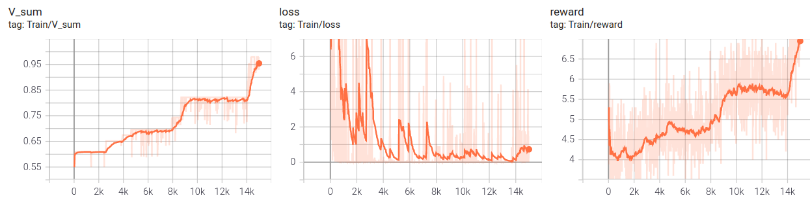

# Reinforcement Learning


---

### Table of Contents
You're sections headers will be used to reference location of destination.

- [Description](#description)
- [How To Use](#how-to-use)

---

## Description

This project contains several code implementations of current research papers in Reinforcement Learning and Deep Reinforcement Learning. 

#### World


The world is implemented as a deterministic Markov Decison Process characterized by an adjustable number of states S and actions A. Transition probabilities and rewards are created randomly. Model-based methods such as Policy-Iteration and Value Iteration are implemented to calculate the optimal policy. This allows to precisely evaluate the later implemented model-free RL methods. The Agents policy can be plugged into the Bellmann equation of the world to see how close it is to optimal.

#### Q-Table Agent
In order to demonstrate the effectivenes of Deep Neural Networks in RL, the following Methods are implemented without a Q-function for comparison. Instead they rely on a table of Q values, which is not scalable but reasonable for the model choice in this project. 
The following methods are compared:
- Monte Carlo (MC)
- Temporal Difference (TD)
- Q-Learning (DQL)

#### DQN Agent

Instead of relying on a Table, in many scenarios it is more feasable to use a Q function. In this project multiple variants of RL Agents using Deep neural Networks as a Q function are compared:

- Monte Carlo (MC)
- Temporal Difference (TD)
- Q-Learning (DQL)

Also the following research papers are implemented in order to improve Q-Learning
-  Double Q Learning (https://arxiv.org/abs/1509.06461)
-  Prioritized Experience Replay (https://arxiv.org/abs/1511.05952)

---

## How To Use

#### Installation
You can clone this repository by running the following command.
```
git clone --recurse-submodules <repository cloning URL>
```
#### Environment Setup
First, we'll create a conda environment to hold the dependencies.
```
conda create --name RLpytorch python=3.8 -y
source activate RLpytorch
pip install -r requirements.txt
```
Then, since this project uses IPython notebooks, we'll install this conda environment as a kernel.
```
python -m ipykernel install --user --name RLpytorch --display-name "Python 3.8 (RLpytorch)"
```

#### Model Training
Model | Command
--- | --- 
Double DQN | ```python train.py --model DoubleDQN```
Prioritized Replay DQN | ```python train.py --model PrioritizedReplayDQN```

You can optionally use ```--A``` and ```--S``` to set the number of possible states and actions in the world. The Training parameters ```--T``` (number of exploration steps), ```--lr``` (learning rate) and ```--K_freeze``` (update period of second weigths pair) can additionally be set. Specificly the Prioritized Replay variant allows you to set parameters from the research paper ```-N``` (size of the memory), ```--alpha``` (priority exponent), ```--beta``` (importance sampling exponent), ```--K``` (memory replay period) and ```--k``` (batchsize).

#### Tensorboard
The tensorboard can be called via the following command.
```tensorboard --logdir "experiments/exp_<your experiment number>"```
It contains the following evaluation metrics:
- loss: measure of how similiar the 2 Q functions are to each other.
- rewards: Average reward over the last 10 action-state pairs during exploration.
- V: Average State-Value of the Agent, relative to optimal State-Value according to the optimal policy of the world.


